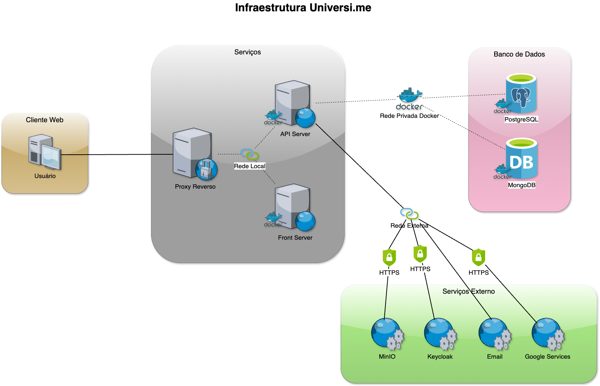

# Infraestrutura

# Serviços

### API Server
- Tecnologias: API REST, Spring Boot, Java, Docker, dockar-compose
- Tipo de Projeto: Maven
- Porta padrão do serviço: 8080 

### Front Server
- Tecnologias: React, Type Script, Docker, docker-compose
- Tipo de Projeto: Npm
- Porta padrão do serviço: 5173 

## Banco de dados
- PostgreSQL
- MongoDB

## Proxy Reverso
- Nginx/Apache: Utilizado para direcionar o dominio para os serviços. 

## Serviços Externos
### MinIO
Utilizado para armazenar imagens manipuladas pela plataforma.

### Keycloak
Comunicação para servidor de autenticação externo.

### Email
Comunicação para servidor de email SMTP.

### Google Services
Utilizado para o serviço de reCaptcha e Login via conta Google.
 
 