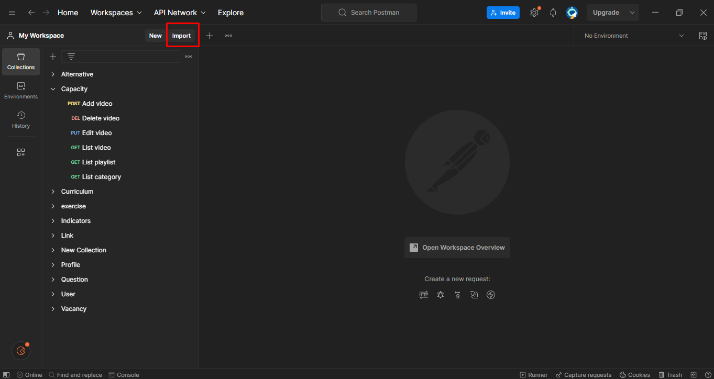
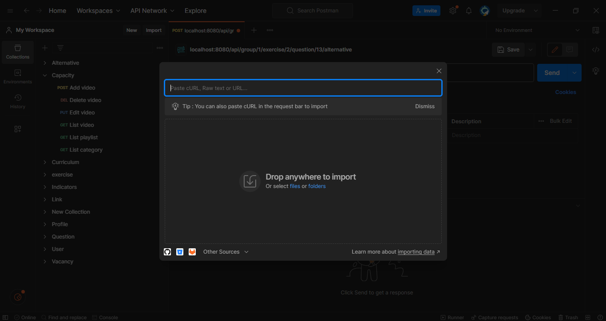
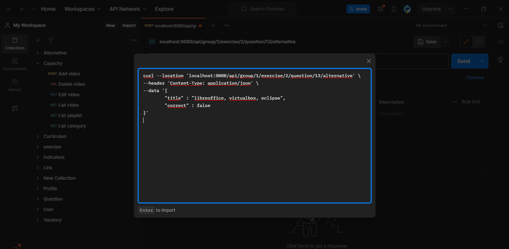
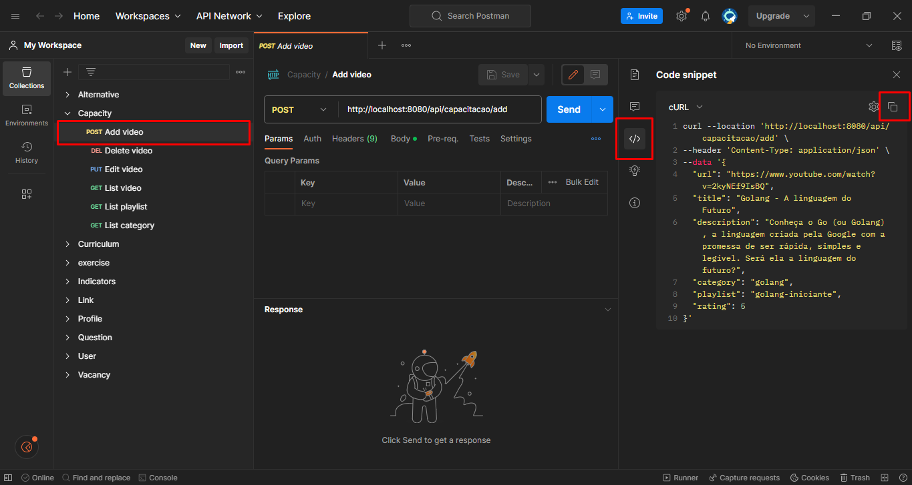

# Introdução
Este documento contém as configurações para as requisições do Postman com os endpoints do sistema e alguns passos precisam ser seguidos para deixá-lo sempre atualizado:

* Para utilizar as configurações deste documento importe o CURL no seu postman (Passo a passo aqui) adicionar link na palavra "aqui"
* Ao finalizar a criação do endpoint, inclua o CURL do postman neste arqui (O passo a passo para fazer isto está descrito aqui) adicionar link na palavra "aqui"
* Sempre que inserir um novo dado neste documento seguir o padrão abaixo:

### [Nome do módulo] Descrição (TIPO)
```plaintext linenums="1"
curl -- (Copiado do Postman)
```

## Importar CURL no seu postman






## Copiar CURL para informar aqui


## Configurações
### [Alternative] Create_alternative (POST)
```json linenums="1"
curl --location 'localhost:8080/api/group/1/exercise/2/question/13/alternative' \
--header 'Content-Type: application/json' \
--data '{
	"title" : "libreoffice, virtualbox, eclipse",
	"correct" : false
}'
```

### [Alternative] List_alternatives (GET)
```json linenums="1"
curl --location --request GET 'localhost:8080/api/group/1/exercise/4/question/16/alternative' \
--header 'Content-Type: application/json' \
--data '{
	"title" : "libreoffice, virtualbox, eclipse",
	"correct" : false
}'
```

### [Alternative] Get_alternative (GET)
```json linenums="1"
curl --location --request GET 'localhost:8080/api/group/1/exercise/4/question/16/alternative' \
--header 'Content-Type: application/json' \
--data '{
	"title" : "libreoffice, virtualbox, eclipse",
	"correct" : false
}'
```

### [Alternative] Update_alternative (PUT)
```json linenums="1"
curl --location --request PUT 'localhost:8080/api/group/1/exercise/4/question/16/alternative/8' \
--header 'Content-Type: application/json' \
--data '{
	"title" : "libreoffice, virtualbox, eclipse ",
	"correct" : false
}'
```

### [Alternative] Delete_alternative (DELETE)
```json linenums="1"
curl --location --request DELETE 'localhost:8080/api/group/1/exercise/4/question/16/alternative/8' \
--header 'Content-Type: application/json' \
--data '{
	"title" : "libreoffice, virtualbox, eclipse ",
	"correct" : false
}'
```

### [Capacity] Add video (POST)
```json linenums="1"
curl --location 'http://localhost:8080/api/capacitacao/add' \
--header 'Content-Type: application/json' \
--data '{
  "url": "https://www.youtube.com/watch?v=2kyNEf9IsBQ",
  "title": "Golang - A linguagem do Futuro",
  "description": "Conheça o Go (ou Golang), a linguagem criada pela Google com a promessa de ser rápida, simples e legível. Será ela a linguagem do futuro?",
  "category": "golang",
  "playlist": "golang-iniciante",
  "rating": 5
}'
```

### [Capacity] Delete video (DELETE)
```json linenums="1"
curl --location --request DELETE 'http://localhost:8080/api/capacitacao/delete/38' \
--data ''
```

### [Capacity] Edit video (PUT)
```json linenums="1"
curl --location --request PUT 'http://localhost:8080/api/capacitacao/edit/1' \
--header 'Content-Type: application/json' \
--data-raw '{
  "url": "https://www.youtube.com/watch?v=0TExBobc-Mi",
  "title": "Tratamento de erros",
  "description": "Aprenda a criar erros personalizados, mensagens personalizadas e muito mais.",
  "category": "golang",
  "playlist": "iniciante-golang",
  "rating": 3
}'
```

### [Capacity] List video (GET)
```json linenums="1"
curl --location 'http://localhost:8080/api/capacitacao/video/1'
```

### [Capacity] List playlist (GET)
```json linenums="1"
curl --location 'http://localhost:8080/api/capacitacao/playlist/iniciante-golang'
```

### [Capacity] List category (GET)
```json linenums="1"
curl --location 'http://localhost:8080/api/capacitacao/categoria/golang'
```

### [Curriculum] Create_Curriculum (POST)
```json linenums="1"
curl --location 'localhost:8080/api/curriculum' \
--header 'Content-Type: application/json' \
--data '{
    "description": "Teste Curriculum 2"
}'
```

### [Curriculum] List_Curriculum (GET)
```json linenums="1"
curl --location 'localhost:8080/api/curriculum' \
--data ''
```

### [Curriculum] Get_Curriculum (GET)
```json linenums="1"
curl --location 'localhost:8080/api/curriculum/1'
```

### [Curriculum] Delete_Curriculum (DELETE)
```json linenums="1"
curl --location --request DELETE 'localhost:8080/api/curriculum/delete/1' \
--data ''
```

### [Curriculum] Update_Curriculum (PUT)
```json linenums="1"
curl --location --request PUT 'localhost:8080/api/curriculum/update/1' \
--header 'Content-Type: application/json' \
--data '{
    "description": "UPDATE"
}'
```

### [exercise] get_Exercise (GET)
```json linenums="1"
curl --location 'localhost:8080/api/group/1/exercise/1' \
--data ''
```

### [exercise] list_Exercise (GET)
```json linenums="1"
curl --location 'localhost:8080/api/group/1/exercise' \
--data ''
```

### [exercise] create_Exercise (POST)
```json linenums="1"
curl --location 'localhost:8080/api/group/1/exercise' \
--header 'Content-Type: application/json' \
--data '{
    "title" : "Laços de repetição em python"
}'
```

### [exercise] update_Exercise (PUT)
```json linenums="1"
curl --location --request PUT 'localhost:8080/api/group/1/exercise/2' \
--header 'Content-Type: application/json' \
--data '{
    "title" : "Laços de repetição em Python: "
}'
```

### [exercise] delete_Exercise (DELETE)
```json linenums="1"
curl --location --request DELETE 'localhost:8080/api/group/1/exercise/1'
```

### [exercise] get_Questions_With_Alternatives (GET)
```json linenums="1"
curl --location 'localhost:8080/api/group/1/exercise/1/questions?amount=10'
```

### [exercise] calculate_exercise (POST)
```json linenums="1"
curl --location 'localhost:8080/api/group/1/exercise/1' \
--header 'Content-Type: application/json' \
--data '[
    {
        "question": {
            "id": 1,
            "title": "QUAL É A IDEIA CENTRAL DO PADRÃO DE PROJETO OBSERVER?",
            "userCreate": {
                "id": 1,
                "name": "admin"
            },
            "feedback": {
                "id": 1,
                "link": "https://exemplo.com/dica-de-estudo-padrao3",
                "feedbackText": "Dica de estudo: Saiba como o padrão de projeto Observer pode ser aplicado em sistemas de eventos."
            }
        },
        "alternativeSelected" : {
                "id": 1,
                "title": "A separação de um objeto em partes menores para facilitar a manutenção.",
                "correct": false
        }
    },
    {
        "question": {
            "id": 2,
            "title": "O que significa o acrônimo MVC e como funciona?",
            "userCreate": {
                "id": 1,
                "name": "admin"
            },
            "feedback": {
                "id": 2,
                "link": "https://exemplo.com/dica-de-estudo-padrao2",
                "feedbackText": "Dica de estudo: Conheça os princípios do padrão de projeto MVC."
            }
        },
        "alternativeSelected": {
                "id": 6,
                "title": "MVC significa Model-View-Controller e é um padrão de projeto utilizado para separar a lógica de negócio, a apresentação e a interação com o usuário em componentes distintos.",
                "correct": true
        }

    },
    {
        "question": {
            "id": 4,
            "title": "Quais são as vantagens e desvantagens do uso do padrão de projeto Singleton?",
            "userCreate": {
                "id": 1,
                "name": "admin"
            },
            "feedback": {
                "id": 4,
                "link": "https://exemplo.com/dica-de-estudo-padrao5",
                "feedbackText": "Dica de estudo: Aprenda a utilizar o padrão de projeto Singleton de forma correta e segura."
            }
        },
        "alternativeSelected": 
            {
                "id": 16,
                "title": "O padrão Singleton garante que uma classe tenha apenas uma instância e fornece um ponto global de acesso a essa instância.",
                "correct": true
            }
    },
    {
        "question": {
            "id": 3,
            "title": "Quais são as principais diferenças entre Factory Method e Abstract Factory?",
            "userCreate": {
                "id": 1,
                "name": "admin"
            },
            "feedback": {
                "id": 3,
                "link": "https://exemplo.com/dica-de-estudo-padrao4",
                "feedbackText": "Dica de estudo: Entenda as diferenças entre o padrão de projeto Factory Method e Abstract Factory."
            }
        },
        "alternativeSelected": {
                "id": 11,
                "title": "O Factory Method cria objetos de uma única classe, enquanto o Abstract Factory cria objetos de uma família de classes relacionadas.",
                "correct": true
        }
    },
    {
        "question": {
            "id": 5,
            "title": "Qual dos padrões de projeto a seguir é mais adequado para implementar uma lógica de negócio complexa em um sistema?",
            "userCreate": {
                "id": 1,
                "name": "admin"
            },
            "feedback": {
                "id": 5,
                "link": "https://exemplo.com/dica-de-estudo-padroes-de-projeto",
                "feedbackText": "Dica de estudo: Explore os padrões de projeto para entender como cada um pode ser aplicado em diferentes cenários de desenvolvimento de software."
            }
        },
        "alternativeSelected": {
                "id": 21,
                "title": "Singleton",
                "correct": false
        }
    }
]
'
```

### [Indicators] get_Indicators (GET)
```json linenums="1"
curl --location 'localhost:8080/api/user/indicators'
```

### [Indicators] get_Ranking_Score (GET)
```json linenums="1"
curl --location 'localhost:8080/api/user/ranking'
```

### [Link] Criar (POST)
```json linenums="1"
curl --location ''
```

### [Profile] Visualizar (GET)
```json linenums="1"
curl --location 'localhost:8080/api/profile/get' \
--header 'Content-Type: application/json' \
--data '{
    "profileId": null,
    "username": "admin"
}'
```

### [Question] get_Question (GET)
```json linenums="1"
curl --location 'localhost:8080/api/group/1/exercise/2/question/13'
```

### [Question] delete_Question (DELETE)
```json linenums="1"
curl --location --request DELETE 'localhost:8080/api/group/1/exercise/2/question/13'
```

### [Question] create_Question (POST)
```json linenums="1"
curl --location 'localhost:8080/api/group/1/exercise/1/question' \
--header 'Content-Type: application/json' \
--data '{
	"title": "São softwares livres:",
	"feedback": {
		"link": "https://www.alura.com.br/artigos/o-que-e-software-livre#:~:text=Software%20Livre%20(Free%20Software)%20%C3%A9,mudar%20e%20melhorar%20o%20software.",
		"feedbackText": "Software Livre (Free Software) é um movimento político e filosófico que preza pela liberdade de acesso do código fonte de qualquer software pela comunidade de usuários."
	}
}'
```

### [Question] update_Question (PUT)
```json linenums="1"
curl --location --request PUT 'localhost:8080/api/group/1/exercise/2/question/13' \
--header 'Content-Type: application/json' \
--data '{
	"title": "São softwares livres:",
	"feedback": {
		"link": "https://www.alura.com.br/artigos/o-que-e-software-livre#:~:text=Software%20Livre%20(Free%20Software)%20%C3%A9,mudar%20e%20melhorar%20o%20software.",
		"feedbackText": "Software Livre (Free Software) é um movimento político e filosófico que preza pela liberdade de acesso do código fonte de qualquer software pela comunidade de usuários."
	}
}'
```

### [Question] list_Question (GET)
```json linenums="1"
curl --location ''
```

### [User] login (POST)
```json linenums="1"
curl --location 'localhost:8080/api/signin' \
--header 'Content-Type: application/json' \
--data '{
    "username" : "admin",
    "password" : "admin"
}'
```

### [User] exit (POST)
```json linenums="1"
curl --location 'localhost:8080/login.js' \
--header 'Content-Type: application/json' \
--data '{
    "username" : "user",
    "password" : "admin"
}'
```

### [Vacancy] Create_Vacancy (POST)
```json linenums="1"
curl --location 'localhost:8080/api/vacancy' \
--header 'Content-Type: application/json' \
--data '{
    "description": "Teste Vacancy 1"
}'
```
